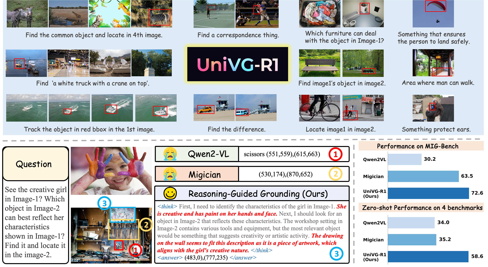

<h1>  UniVG-R1:
Reasoning Guided Universal Visual Grounding with Reinforcement Learning </h1>

 

 
<!-- 
 -->

 

<a href="https://sulebai.github.io/">Sule Bai</a>1,2,
<a href="https://scholar.google.com/citations?user=-pfkprkAAAAJ&hl=zh-CN&oi=ao" target="_blank">Mingxing Li</a>2,
<a href="https://yongliu20.github.io/">Yong Liu</a>1,
<a href="" target="_blank">Jing Tang</a>2,
<a href="https://zhang9302002.github.io/">Haoji Zhang</a>1,
<a href="" target="_blank">Lei Sun</a>2,
<a href="https://cxxgtxy.github.io/">Xiangxiang Chu</a>2,
<a href="https://andytang15.github.io/">Yansong Tang</a>1

    1Tsinghua University
    2ALibaba Group

## ToDo
- [ ] The code, models, and data will be released soon after a legal inspection.
- [x] We release our paper in [arxiv](https://arxiv.org/abs/2505.14231).

## 📖 Overview
1. We propose UniVG-R1, a reasoning guided MLLM for universal visual grounding, which employs GRPO with a cold-start initialization to effectively enhance reasoning capabilities across multimodal contexts.
2. A high-quality CoT dataset is introduced, encompassing diverse tasks, each meticulously annotated with detailed reasoning chains to facilitate advanced reasoning-based grounding.
3. We identify a difficulty bias in GRPO training, and propose a difficulty-aware weight adjustment strategy. Experiments validate that GRPO equipped with this strategy consistently enhance the model performance.
4. Extensive experiments demonstrate that our model achieves state-of-the-art performance across multiple grounding benchmarks, showcasing its versatility and generalizability.

## 📈Results

Performance on the MIG-Bench.

Zero-shot performance on several reasoning grounding benchmarks.

## 🌹 Acknowledgement
Our work is primarily based on [Migician](https://github.com/thunlp/Migician), [VLM-R1](https://github.com/om-ai-lab/VLM-R1), [LLaMA-Factory](https://github.com/hiyouga/LLaMA-Factory), [lmms-eval](https://github.com/EvolvingLMMs-Lab/lmms-eval). We are sincerely grateful for their excellent works.

